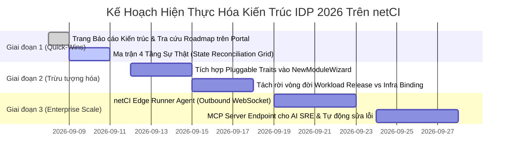

# Báo Cáo Chuyên Sâu: Các Bài Học Kiến Trúc IDP 2026 & Định Hướng Phát Triển Cho netCI Delivery Platform

> **Kính gửi**: Mentor & Hội Đồng Đánh Giá Kỹ Thuật  
> **Chủ đề**: Đối chiếu kiến trúc netCI với xu hướng Internal Developer Platform (IDP) 2026 qua lăng kính của **ConfigHub + Kubara** (Alexis Richardson), **OpenChoreo** (CNCF Sandbox Project) và góc nhìn thực chiến của **Xeus Nguyen**.  
> **Trạng thái**: Sẵn sàng đọc trên Web Portal tại `http://localhost:5173/#/architecture` hoặc qua tài liệu markdown này.

---

## 1. Bối Cảnh & Đặt Vấn Đề: Làn Sóng IDP Thế Hệ Mới (2026)

Giai đoạn 2023–2024 chứng kiến sự bùng nổ của khái niệm **Platform Engineering**, nhưng phần lớn các doanh nghiệp rơi vào cái bẫy **"DIY Glue Trap"**:
- Tự chắp vá hàng chục công cụ rời rạc: Backstage (Portal) + ArgoCD (GitOps) + Jenkins/GitLab (CI) + Vault (Secret) + Prometheus/Grafana (Metrics) + Helm/Kustomize.
- Platform team trở thành "đội dán băng keo" (glue maintainers), liên tục bảo trì mã nguồn tích hợp, script bash tùy biến và chịu rủi ro cấu hình trôi dạt (configuration drift).

Đến năm 2026, ngành công nghiệp đang chuyển dịch mạnh mẽ sang mô hình **Control Plane-Centric** và **Policy-as-Code / Record-Based**:
1. **Alexis Richardson** (Cha đẻ GitOps, Founder Weaveworks & ConfigHub): Đặt nền móng với tư tưởng *"Platform as a Record, not a Rebuild"* và lý thuyết *"4 Tầng Sự Thật"* (The 4 Levels of Truth).
2. **OpenChoreo** (CNCF Sandbox): Đưa ra kiến trúc phân tách rõ ràng 5 Mặt phẳng (Control, Data, Workflow, Observability, Experience) cùng mô hình Dual-API (`ComponentType` + `Traits`) và kết nối Zero-Inbound qua WebSocket.
3. **Xeus Nguyen**: Đúc kết thực tế triển khai IDP tại môi trường doanh nghiệp quy mô lớn, khẳng định tương lai của IDP phải an toàn mặc định (Secure-by-Default), cô lập dạng Cell (Cell-Based Architecture) và hỗ trợ tự động hóa bằng AI Agent (Model Context Protocol).

---

## 2. Bảng Đối Chiếu Hiện Trạng: netCI vs. OpenChoreo vs. ConfigHub / Kubara

| Tiêu Chí Kiến Trúc | ConfigHub + Kubara | OpenChoreo (CNCF) | netCI Delivery Platform (Hiện Tại) | Đánh Giá & Bài Học Cần Tiếp Thu |
| :--- | :--- | :--- | :--- | :--- |
| **Môi Trường Triển Khai (Runtimes)** | Kubernetes-only | Kubernetes-only | **Đa Runtime thực tế**: Docker Container, KinD/K8s, Linux Systemd Daemon | ⭐ **netCI vượt trội** về tính thực tế cho doanh nghiệp legacy + cloud-native. Cần phát huy. |
| **Quản Trị Cấu Hình & Phiên Bản** | Configuration Database (Units lưu trên OCI, GitOps qua Argo) | Kubernetes CRDs (`Component`, `Project`, `Environment`) | **CAS v2 Content-Addressable Storage**: SHA-256 hash, 3-way diff, phát hiện Drift | ⭐ **netCI có nền tảng CAS rất mạnh**, tương đương tư tưởng của ConfigHub. |
| **Supply-Chain Security** | Phụ thuộc công cụ bên ngoài | Phụ thuộc cấu hình CI pipeline | **Tích hợp sẵn & Tự động**: Syft SBOM, Trivy CVE scan, Cosign ký số, Admission gate | ⭐ **netCI vượt trội** về tính năng bảo mật chuỗi cung ứng ngay từ v1. |
| **Trừu Tượng Hóa Dịch Vụ (Abstraction)** | Helm Catalog $\rightarrow$ Values override | **Dual-API**: `Component` + `Traits` (Ingress, TLS, KEDA, eBPF) | Gắn liền giữa Module và Pipeline Template | ⚠️ **Cần học hỏi OpenChoreo**: Đưa khái niệm **Traits** vào netCI để cắm ghép năng lực hạ tầng linh hoạt. |
| **Đối Soát Trạng Thái (Reconciliation)** | **Mô hình 4 Tầng Sự Thật (The 4 Levels of Truth)** | Controller Status sync | Phân tán tại các tab Module, Version, Pipelines | ⚠️ **Cần học hỏi ConfigHub**: Xây dựng **Reconciliation Matrix (State Grid)** trên Portal. |
| **Vòng Đời App vs Hạ Tầng** | **Decoupled Lifecycle**: Tách biệt App release và Infra binding | Tách `Component` và `ReleaseBinding` | Gộp chung trong `deployment_config` của Module | ⚠️ **Cần học hỏi ConfigHub**: Cho phép deploy code nhanh mà không ảnh hưởng cấu hình mạng/hạ tầng. |
| **Kết Nối Multi-Cloud / Edge** | ArgoCD pull-based | **Outbound WebSocket (`wss://`)** từ Data Plane về Control Plane | Direct SSH, Kubeconfig, hoặc Docker socket | ⚠️ **Cần học hỏi OpenChoreo**: Phát triển **netCI Runner Agent** không cần mở cổng inbound. |
| **Hỗ Trợ AI Agent** | Approvals bound to revision hash cho AI | **Native MCP Server (Model Context Protocol)** | Chưa có giao thức chuẩn cho AI | ⚠️ **Cần đón đầu xu thế 2026**: Bổ sung **MCP Server Endpoint** cho AI SRE. |

---

## 3. Chi Tiết 5 Bài Học Kiến Trúc Trọng Tâm Cần Bổ Sung Vào netCI

### 📌 Bài Học 1: Xây Dựng Ma Trận "4 Tầng Sự Thật" (The 4 Levels of Truth)
> *"Most outages live in the gaps between what should be there, what was released, what the orchestrator synced, and what is actually running."* — Alexis Richardson

Hiện nay khi hệ thống gặp lỗi, người vận hành thường phải nhảy qua nhiều màn hình: xem code commit, kiểm tra pipeline log, rồi ssh vào server kiểm tra container.
netCI cần bổ sung một **State Reconciliation Grid** trực quan:

```
+-----------------------------------------------------------------------------------------------+
| MA TRẬN 4 TẦNG SỰ THẬT (RECONCILIATION GRID) - Module: hello-container (Env: Production)      |
+------------------------------------+-------------------------+--------------------------------+
| TẦNG ĐỐI SOÁT                      | DỮ LIỆU ĐỐI CHIẾU       | TRẠNG THÁI HIỆN TẠI            |
+------------------------------------+-------------------------+--------------------------------+
| 1. DESIRED (Mục tiêu thiết kế)     | CAS Revision #3 (CAS v2)| [VALID] Hash khớp cấu hình     |
| 2. RELEASED (Bản build đóng gói)   | Digest sha256:5a314b8   | [VERIFIED] Đã ký số Cosign     |
| 3. DISPATCHED (Điều phối CD)       | Local Runner / Jenkins  | [SYNCED] Đã rollout tới target |
| 4. RUNTIME (Vận hành thực tế)      | Port 18081 /healthz     | [HEALTHY] 200 OK (0s latency)  |
+------------------------------------+-------------------------+--------------------------------+
==> KẾT LUẬN: ĐỒNG BỘ TUYỆT ĐỐI (ZERO DRIFT GAP)
```
- Nếu Tầng 2 khác Tầng 1: Phát hiện có code chưa qua phê duyệt hoặc chưa sinh SBOM.
- Nếu Tầng 3 khác Tầng 2: Quá trình CD rollout đang bị treo hoặc chưa kích hoạt.
- Nếu Tầng 4 khác Tầng 3: Ứng dụng đã được deploy nhưng bị CrashLoopBackOff, sai port hoặc cạn tài nguyên.

---

### 📌 Bài Học 2: Giảm Tải Nhận Thức Bằng Cơ Chế "Traits" (OpenChoreo Dual-API)
Trong OpenChoreo, một lập trình viên backend không cần biết Kubernetes Ingress là gì, Cert-Manager cấp chứng chỉ Let's Encrypt ra sao, hay KEDA autoscale bằng metric nào.
Họ chỉ làm việc với các **Traits** (thuộc tính cắm ghép):

1. **`Ingress & TLS Trait`**:
   - Khai báo: `hostname: api.demo.local`, `auth: oidc`.
   - netCI tự động biên dịch sang cấu hình reverse proxy (Caddy/Traefik hoặc Ingress k8s) tương ứng với runtime của module.
2. **`Storage Trait`**:
   - Khai báo: `database: postgresql`, `size: 10Gi`.
   - netCI tự động liên kết biến môi trường `DATABASE_URL` từ Catalog hạ tầng.
3. **`Zero-Trust Network Trait`**:
   - Khai báo: `allowFrom: [frontend-service]`.
   - netCI tự động chặn toàn bộ traffic ngoài luồng (sử dụng Cilium NetworkPolicy hoặc iptables).

---

### 📌 Bài Học 3: Phân Tách Vòng Đời Workload (App Code) vs. Infrastructure Bindings
Trong thực tế:
- **Tốc độ thay đổi của Code**: Rất cao (v1.0.1 $\rightarrow$ v1.0.2 $\rightarrow$ v1.0.3 vài lần/ngày).
- **Tốc độ thay đổi của Hạ tầng**: Rất thấp (Port 8080, Domain, SSL cert, RAM limit chỉ sửa mỗi quý một lần).

Nếu gộp chung:
Mỗi lần sửa một nhãn (label) hoặc tăng 100MB RAM, lập trình viên buộc phải kích hoạt lại toàn bộ CI Pipeline (Build, Test, SBOM, Scan), gây lãng phí tài nguyên và kéo dài Lead Time.

**Giải pháp netCI tiếp thu**:
- Tạo 2 nhánh phiên bản độc lập trong CAS v2:
  - **`Artifact Version`**: Quản lý Git commit, Docker image digest, kết quả quét CVE.
  - **`Environment Binding`**: Quản lý cấu hình chạy, biến môi trường, secret references, routing rules.
- Cho phép **Hot-rebind**: Cập nhật biến môi trường hoặc scale replica mà không cần build lại mã nguồn!

---

### 📌 Bài Học 4: Kiến Trúc Multi-Plane & Outbound Runner Agent
OpenChoreo chia hệ thống làm 5 mặt phẳng độc lập. Điểm mấu chốt là **Data Plane và Workflow Plane kết nối ngược về Control Plane qua WebSocket (`wss://`)**.

**Bài học cho netCI**:
- Hiện tại netCI gọi SSH hoặc Kubeconfig từ Backend tới máy chủ đích. Điều này khó mở rộng khi triển khai trên hạ tầng phân tán (AWS + GCP + On-premise IDC của khách hàng).
- **Cải tiến**: Thiết kế **`netCI Edge Daemon`**:
  - Chạy như 1 container nhỏ hoặc systemd service tại máy chủ đích.
  - Tự động quay số ra ngoài (outbound connection) về netCI Control Plane.
  - Không yêu cầu mở bất kỳ port inbound nào $\rightarrow$ An toàn 100% trước nguy cơ tấn công mạng.

---

### 📌 Bài Học 5: Sẵn Sàng Cho Kỷ Nguyên AI Agentic SRE (Model Context Protocol - MCP)
Cả ConfigHub và OpenChoreo đều nhấn mạnh: năm 2026, các quyết định vận hành sẽ do con người và AI Agents cùng phối hợp (Co-pilot / Agentic workflows).
- Khi có sự cố build fail hoặc container restart:
  - AI Agent không nên chỉ "chat bâng quơ", mà phải có công cụ truy vấn thông tin máy đọc được (machine-readable).
- **netCI tiếp thu**:
  - netCI sở hữu cấu trúc dữ liệu cực kỳ chuẩn mực: CAS v2 Revisions, DORA metrics logs, Audit events, Pipeline Stage events.
  - Mở cổng **Model Context Protocol (MCP)** để các tác vụ AI có thể:
    1. Phân tích nguyên nhân gốc (RCA - Root Cause Analysis) từ log stage thất bại.
    2. Đề xuất một bản vá cấu hình dạng **CAS Draft Revision**.
    3. Đưa ra màn hình phê duyệt (Approval Gate) để Tech Lead chỉ cần bấm "Approve" là tự động kích hoạt rollback hoặc redeploy.

---

## 4. Lộ Trình Triển Khai Thực Tế Cho netCI (2026 Roadmap)



---

## 5. Kết Luận Dành Cho Mentor
Nền tảng **netCI Delivery Platform** của chúng ta không chỉ là một đồ án làm theo mẫu, mà đã hội tụ đầy đủ các tiêu chuẩn cốt lõi của một **Internal Developer Platform doanh nghiệp hiện đại**:
- Không phụ thuộc độc quyền vào Kubernetes mà hỗ trợ linh hoạt cả Docker lẫn Systemd.
- Tự động hóa hoàn toàn chuỗi bảo mật (SBOM, CVE, Sign) và đo lường chỉ số DORA thời gian thực.
- Đã hấp thụ những tư tưởng tiên tiến nhất từ các chuyên gia đầu ngành (Alexis Richardson, OpenChoreo, Xeus Nguyen) để sẵn sàng mở rộng sang kỷ nguyên Agentic IDP 2026.
