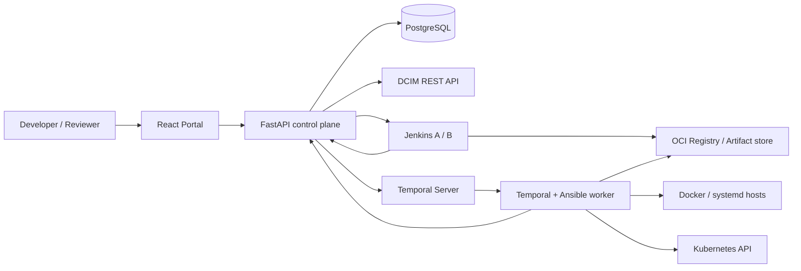
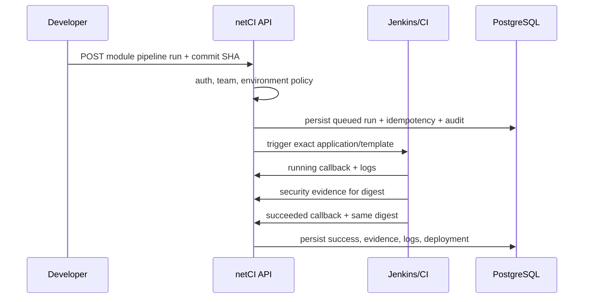

# Giải thích netCI từ bài toán đến code chạy thật

Tài liệu này mô tả **trạng thái hiện tại của source code**, không mô tả một mockup hay ý tưởng tương lai. Mục tiêu là giúp người đọc có thể giải thích lại vì sao hệ thống tồn tại, dữ liệu đi đâu, rule nằm ở đâu, service nào làm việc gì và điều gì phải cấu hình trước khi dùng production.

## 1. Bài toán netCI giải quyết

Trong một tổ chức có nhiều ứng dụng và nhiều kiểu runtime, CI/CD thường bị phân mảnh:

- mỗi team viết pipeline theo một kiểu;
- build và deploy không cùng một audit trail;
- khó chứng minh artifact được deploy chính là artifact đã test, scan và ký;
- production approval dễ trở thành một nút bấm không gắn với danh tính hoặc separation of duties;
- deploy Docker, Kubernetes và systemd có cơ chế khác nhau;
- DORA metric dễ bị biến thành số trang trí vì không truy ngược được source event.

netCI giải quyết bài toán đó bằng một **control plane delivery**. Nó không thay Git, Jenkins, registry, DCIM, Temporal, Kubernetes hay Ansible. Nó đặt policy và state machine ở giữa các hệ thống này để mọi release đi qua cùng một hợp đồng.

Giá trị cốt lõi không phải là “có một giao diện CI đẹp”. Giá trị là:

1. danh tính, quyền và team ownership được kiểm tra trước command;
2. một commit tạo ra một immutable artifact digest;
3. SBOM, vulnerability scan và chữ ký gắn với đúng digest đó;
4. production dùng lại artifact đã chứng minh, không rebuild;
5. approval và kết quả deploy được lưu bền vững, có correlation ID;
6. DORA được project từ delivery event thật.

## 2. Ranh giới hệ thống



- **Portal** gửi command và hiển thị projection từ API. Portal không tự tạo dữ liệu nghiệp vụ.
- **FastAPI** là cổng HTTP, composition root, authentication/authorization boundary và nơi map lỗi domain thành contract ổn định.
- **DeliveryPlatform** giữ invariant của delivery: state transition, idempotency, evidence, audit và source event.
- **PortalReadModel** liên kết khái niệm doanh nghiệp System/Module/Version/ProductionRequest với delivery Application/PipelineRun/Deployment.
- **PostgreSQL** là source of truth khi chạy ngoài local. Production thiếu database sẽ fail khi khởi động, không rơi về memory.
- **Jenkins** thực hiện CI thật. Chế độ callback cho phép một CI engine khác thực hiện rồi báo kết quả bằng machine credential.
- **Temporal** giữ workflow dài, retry và schedule qua restart.
- **Ansible** chạm runtime thật. Host được giới hạn theo target đã lưu; Kubernetes chỉ nhận secret reference, không nhận kubeconfig thô từ browser.
- **DCIM** là nguồn service/module/server inventory. Không cấu hình thì API trả `not_configured` và danh sách rỗng.

## 3. Vì sao kiến trúc chọn cách này

### Custom portal thay vì nhét logic vào Jenkins

Jenkins giỏi thực thi job nhưng không phù hợp làm system of record cho ownership, production request, approval và DORA. Nếu rule nằm trong Jenkinsfile của từng repo, mỗi team có thể vô tình hoặc cố ý thay rule. Vì vậy Jenkins là execution engine; netCI là policy/control plane.

### Temporal cho CD dài hạn

Deploy có thể chờ approval, chờ lịch, retry network operation và sống qua restart. Một HTTP request hoặc background task trong API không đảm bảo được những thuộc tính đó. Temporal lưu execution history và dùng workflow ID tất định `netci-deploy-{deploymentId}` để retry không tạo workflow trùng.

### Ansible làm runtime adapter

Ba runtime cần thao tác khác nhau nhưng cùng cần một interface `deploy / health_check / rollback`. Ansible cung cấp SSH, Docker collection, Kubernetes collection và playbook idempotent. Domain chỉ biết port `RuntimeRunner`; command chi tiết nằm ở adapter.

### Immutable digest thay tag

Tag có thể bị ghi đè; `sha256:...` định danh chính xác bytes/image manifest. Vì vậy CI success, evidence, release version, deployment và rollback đều nối bằng digest. Production không build lại.

### Projection thay vì lưu DORA như KPI nhập tay

Deployment frequency, lead time, change failure rate và MTTR được tính lại từ `delivery_events`. API trả cả time window và `sourceEventCount`, giúp con số truy nguyên được.

### Deep modules và adapter seams

Code chia theo ranh giới thay đổi:

- đổi Jenkins không làm đổi domain;
- đổi Temporal không làm đổi API contract;
- đổi PostgreSQL implementation không làm đổi state rule;
- đổi DCIM vendor chỉ cần giữ contract catalog;
- thêm runtime mới cần adapter/template thay vì chèn điều kiện khắp UI.

## 4. Ngôn ngữ domain cần nhớ

| Khái niệm | Ý nghĩa |
|---|---|
| System | Một service/business system trong portal, chứa nhiều module. |
| Module | Thành phần deploy độc lập và ánh xạ 1–1 tới một Delivery Application. |
| Application | Aggregate kỹ thuật sở hữu repository, runtime, template và pipeline runs. |
| PipelineRun | Một lần chạy cho commit, branch, environment và parameter cụ thể. |
| SecurityEvidence | SBOM + scan + signature cho đúng run và artifact digest. |
| Version | Nhãn release có provenance tới successful pipeline run và digest. |
| ProductionRequest | Yêu cầu promote đúng một version của một module lên production. |
| Deployment | Lần đưa immutable artifact vào một environment. |
| DeliveryEvent | Fact bất biến dùng làm đầu vào DORA. |
| AuditRecord | Ai làm gì, với application/run/deployment nào và correlation nào. |

`System/Module/Version/ProductionRequest` phục vụ ngôn ngữ portal. `Application/PipelineRun/Deployment/DeliveryEvent` là lõi delivery. Việc tách hai nhóm giúp UI phát triển mà không làm loãng invariant delivery.

## 5. State machine

Pipeline run:

```text
queued -> running -> succeeded
                  -> failed
                  -> cancelled
        -> waiting_approval -> running -> succeeded / failed / rolled_back
```

Deployment:

```text
pending_approval -> deploying -> healthy
                               -> failed -> rolled_back
```

Rule quan trọng:

- callback terminal lặp lại cùng kết quả là idempotent;
- callback khác kết quả sau terminal bị từ chối;
- chỉ deployment `pending_approval` được approve;
- chỉ deployment `deploying` nhận kết quả healthy/failed;
- rollback cần target digest bất biến;
- optimistic version trong PostgreSQL ngăn hai process cùng thắng một transition.

## 6. Luồng onboarding module

1. Portal gọi `GET /dcim/services` để tìm system/service thật.
2. Người dùng tạo System bằng ID bất biến do DCIM trả về; backend lấy `owner` từ danh tính đã xác thực, không tin dữ liệu actor/owner do trình duyệt gửi lên.
3. Portal gọi `GET /dcim/modules?systemId=...` và `GET /dcim/servers?...`.
4. Người dùng chọn module, runtime, runner routing label và environment target.
5. `POST /systems/{systemId}/modules` tạo Delivery Application rồi gắn Portal Module.
6. Backend kiểm tra runtime khớp template, environment không trùng, Docker/systemd có server, Kubernetes có namespace và kubeconfig secret reference.
7. `ownerTeam` được lấy từ verified identity team; người không thuộc team không được tự gán ownership đó.

Nếu bước gắn module thất bại sau khi application đã tạo thì hiện vẫn có khả năng để lại application orphan. Code đã validate slot trước khi tạo để giảm trường hợp này, nhưng hai aggregate vẫn chưa nằm trong cùng một transaction. Đây là một giới hạn kiến trúc cần xử lý nếu onboarding có lưu lượng lớn.

## 7. Luồng CI thật



Hai mode hợp lệ:

- `NETCI_CI_MODE=jenkins`: API gọi controller thật qua router A/B.
- `NETCI_CI_MODE=none`: API lưu run và chờ CI ngoài gọi callback đã xác thực. `none` không tự chuyển success và không sinh log giả.

Portal bắt buộc người dùng nhập Git commit SHA thật. Actor, correlation ID và Jenkins run ID được backend lưu; UI không tự điền tên người hoặc duration.

## 8. Supply-chain gate

CI phải publish:

- `artifactDigest` dạng `sha256:<64 hex>`;
- SBOM do Syft tạo và vị trí lưu;
- vulnerability report do Trivy tạo, gồm finding ID khi muốn áp exception;
- signature metadata của Cosign;
- optional artifact reference và build run ID.

Evidence được lưu trong PostgreSQL theo pipeline run. Artifact digest trong evidence phải khớp digest trong CI result. Production promotion luôn yêu cầu evidence hợp lệ, kể cả khi gate cho non-production được cấu hình mềm hơn.

Temporal worker đọc lại evidence từ API ngay trước deploy và dùng Cosign verify bằng public key của phía deploy. Lý do verify lần hai: boolean `signature.verified` do chính CI gửi chỉ là một lời khai; worker cần tự chứng minh artifact sắp chạy đúng là artifact được ký.

Security exception không miễn theo số lượng chung. Nó gắn với một CVE cụ thể, một digest cụ thể, expiry, owner và approver để tránh “exception vĩnh viễn cho mọi bản build”.

## 9. Version và production promotion

Một version chỉ **promotable** khi metadata nối tới:

- một pipeline run đã `succeeded`;
- cùng application/module;
- cùng immutable artifact digest;
- security evidence được policy cho phép.

Luồng production hiện hỗ trợ đúng **một module mỗi request**:

1. Developer tạo request với version, timezone-aware schedule, rollback strategy và automation gate.
2. Nếu bật automation gate, version phải có CI report `autoTest: passed`.
3. Reviewer khác requester approve khi separation of duties bật.
4. Backend tạo một production PipelineRun mới nhưng reuse digest/evidence của source run.
5. Backend thay target bằng cấu hình `prod` lưu server-side; không kế thừa server staging và không cho body của browser đổi target.
6. Approval chuyển deployment sang `deploying` và start Temporal.
7. Workflow chờ `notBefore`, verify artifact, chạy playbook, health gate và rollback theo strategy.
8. Worker callback kết quả về API; API đóng PipelineRun, Deployment và ProductionRequest.

Multi-module orchestration bị từ chối rõ bằng `MULTI_MODULE_ORCHESTRATION_UNAVAILABLE`; hệ thống không giả vờ đã orchestration tuần tự khi chưa có saga/compensation thật.

## 10. Runtime deployment

Worker image riêng chứa:

- `ansible-core`;
- `community.docker` và `kubernetes.core`;
- Python Docker/Kubernetes clients;
- OpenSSH client;
- Cosign binary.

Với Docker/systemd, `target_hosts` lấy từ module config và được kiểm tra ký tự an toàn trước khi đưa vào `ansible-playbook --limit`. Thiếu host thì fail, không deploy ngầm lên cả inventory.

Với Kubernetes, browser chỉ lưu một `kubeconfigRef`. Worker resolve file đó bên dưới `NETCI_KUBECONFIG_DIR`; path traversal bị từ chối. Namespace cũng đến từ server-owned environment config.

Các checked-in playbook sở hữu thứ tự task thật và health gate thật. Wizard không còn cho sửa một danh sách task mà runtime không thực thi. Docker/systemd dùng HTTP health trong playbook; Kubernetes dùng Helm `wait + atomic` và xác nhận immutable artifact.

Artifact reference trong evidence được adapter chuyển thành `image_repository` cho container runtime hoặc `artifact_url` cho systemd; digest luôn truyền riêng và được playbook kiểm tra.

## 11. Authentication và authorization

Ba auth mode:

- `none`: chỉ local loopback, dùng cho dev;
- `token`: token file lưu hash SHA-256, phù hợp pilot/machine-to-machine;
- `oidc`: verify JWT signature/issuer/audience và map claim sang role/team, phù hợp production.

Role quyết định **được làm loại hành động nào**. `ownerTeam` quyết định **được làm trên application nào**. Cả hai đều phải pass.

- Developer: tạo module/run/request trong scope team và environment được phép.
- Reviewer: approve production; separation of duties có thể bắt reviewer khác requester.
- Platform admin: quản trị rộng.
- Pipeline: chỉ callback CI/evidence/deployment; không có quyền approve.

List và detail endpoint đều lọc theo application visibility. Raw delivery events, logs, evidence, audit, DORA và production requests không được rò sang team khác.

## 12. Persistence, idempotency và audit

Migrations trong `backend/migrations` là nguồn schema. `backend/schema.sql` là file generate để compose init database; CI kiểm tra hai phía không drift.

Delivery write dùng Unit of Work: persist database trước, sau đó cập nhật in-memory projection. Nếu database lỗi, API trả `PERSISTENCE_UNAVAILABLE`; không báo thành công bằng state chỉ tồn tại trong RAM.

Idempotency key lưu cả request hash và resource ID. Replay cùng body trả resource cũ; reuse key với body khác trả conflict. Record được rehydrate khi restart cho create application, start pipeline và production request.

Audit record chứa actor, action, application/run/deployment ID, correlation ID, payload và timestamp. Activity Log lấy từ backend. UI không còn sessionStorage “audit” hay fake activity.

## 13. DORA tính như thế nào

- Deployment Frequency: số production deployment thành công trong rolling window, quy đổi theo tuần.
- Lead Time for Changes: thời gian từ commit timestamp tới production success.
- Change Failure Rate: tỷ lệ production deployment cần can thiệp/failed/rollback.
- MTTR: thời gian từ failure event tới recovery event gắn với failure đó.

Không có source event thì giá trị bằng 0/null và UI nói rõ chưa có dữ liệu. System metric được tính từ union event stream của các module người dùng được quyền xem, không lấy trung bình các KPI con.

## 14. Frontend hiện hiển thị gì

- Dashboard/System/Module gọi API thật và có loading/error/empty state.
- System status được suy ra từ deployment mới nhất theo module/environment; chưa có signal thì `unknown`.
- Server page là read-only projection của target đã cấu hình; health không có provider thì `unknown`.
- Module overview lấy deployment, release và CI report thật.
- Pipeline page lấy run/log thật; stage chưa có event model thì ghi `Status unavailable`.
- Version page lấy release record thật và bắt buộc provenance khi đăng ký qua UI.
- Production page chỉ hiển thị state request thật.
- DORA chỉ hiển thị metric + time window + source event count thật.

Frontend không import fixture runtime. Demo seed chỉ xuất hiện khi operator chủ động đặt `NETCI_DEMO_DATA=true`; mặc định là `false`.

Compose build Portal thành static bundle bằng Node 22 rồi phục vụ qua Nginx chạy non-root ở cổng 8080 trong container. Nginx proxy `/api` tới `netci-api`, nên browser và API cùng origin; history fallback, cache asset, healthcheck, CSP và các security header nằm trong `frontend/nginx.conf` thay vì phụ thuộc Vite development server.

## 15. Cấu hình live tối thiểu

Production cần cung cấp từ bên ngoài repository:

```text
NETCI_ENVIRONMENT=production
DATABASE_URL_FILE=/run/secrets/netci/database-url
NETCI_AUTH_MODE=oidc
NETCI_OIDC_ISSUER=...
NETCI_OIDC_AUDIENCE=...
NETCI_OIDC_ROLE_MAP=...
NETCI_PIPELINE_API_KEY=...
NETCI_CI_MODE=jenkins              # hoặc CI ngoài + callback
NETCI_CD_MODE=temporal             # hoặc CD ngoài + callback
NETCI_DCIM_BASE_URL=...
NETCI_SIGNATURE_VERIFY_MODE=cosign
NETCI_COSIGN_PUBLIC_KEY_FILE=/run/secrets/netci/cosign.pub
NETCI_ANSIBLE_PRIVATE_KEY_FILE=/run/secrets/netci/ssh/id_ed25519
NETCI_ANSIBLE_KNOWN_HOSTS_FILE=/run/secrets/netci/ssh/known_hosts
NETCI_REQUIRE_APPLICATION_OWNER=true
NETCI_REQUIRE_SEPARATION_OF_DUTIES=true
NETCI_REQUIRE_SECURITY_EVIDENCE=true
```

`docker compose up --build` dựng Portal ở `http://localhost:5173`, API, PostgreSQL, Temporal worker, registry, MinIO và hai Jenkins controller. Vì Portal đi qua reverse proxy, `auth=none` bị API từ chối có chủ đích; ngay cả local Compose cũng phải dùng token file hoặc OIDC (xem `QUICKSTART.md`). Các giá trị `change-me-local-only`/`replace-me-local-only` chỉ giúp topology local khởi động; một môi trường non-local phải thay chúng bằng secret thật trước khi được coi là live.

Ngoài biến môi trường còn cần:

- chạy đủ migration trước khi API start;
- DCIM server hostname trùng inventory alias mà Ansible worker dùng;
- SSH host key/private key hoặc Kubernetes kubeconfig được mount dưới secret directory;
- Jenkins credential và webhook/callback reachability;
- registry/artifact store reachable từ CI lẫn worker;
- TLS/reverse proxy, backup PostgreSQL và log/metric collector ở hạ tầng deploy.

Không credential thật nào được commit vào repository. Vì vậy “source hỗ trợ live” và “một deployment đang live” là hai mệnh đề khác nhau: vế sau chỉ đúng sau khi operator nối các dependency trên và chạy acceptance gate trong chính môi trường đó.

## 16. Cách đọc source hiệu quả

Đọc theo thứ tự này:

1. `CONTEXT.md`, `docs/domain-model.md`, `docs/state-machine.md` để nắm từ vựng và invariant.
2. `backend/app/domain/models.py` để thấy aggregate state.
3. `backend/app/delivery.py` để hiểu mọi transition quan trọng.
4. `backend/app/policy/rules.py` cho artifact/team policy.
5. `backend/app/main.py` cho HTTP/auth mapping.
6. `backend/app/portal.py` cho System/Module/Version/Request projection.
7. `backend/app/persistence.py` và migrations cho durability/concurrency.
8. `backend/app/adapters/*` cho Jenkins/DCIM/Temporal/Cosign boundary.
9. `backend/app/workflows/*` rồi `deploy/ansible/playbooks/*` cho CD thật.
10. `frontend/src/api/netciClient.ts`, sau đó từng page component.
11. `tests/contract`, backend tests, failure/performance gates để hiểu điều hệ thống hứa.

## 17. Những giới hạn còn lại, không che giấu

1. Production request mới orchestration một module; saga đa module chưa có.
2. System chưa có owner-team aggregate riêng; access thực tế suy ra từ module applications.
3. Portal module + delivery application chưa commit trong cùng một database transaction.
4. Workflow rollback thành công sau health failure hiện callback về core dưới dạng deployment failed kèm message; core chưa có terminal state “runtime restored by workflow rollback” đầy đủ để phản ánh recovery riêng.
5. Pipeline stage mới là cấu hình; chưa có per-stage event/duration model từ Jenkins callback.
6. `/servers` chưa có health collector; chỉ có configured target và trạng thái `unknown`.
7. Repository không thể tự cung cấp OIDC tenant, DCIM endpoint, SSH key, kubeconfig, registry credential hoặc production DNS/TLS.

Đây là backlog thật, không phải chức năng “đã xong” được giấu sau dữ liệu mẫu.

## 18. Definition of Done cho một môi trường production

Chỉ gọi môi trường là live khi có bằng chứng cho tất cả mục sau:

- API start với PostgreSQL và restart vẫn giữ application/run/evidence/audit/request.
- OIDC login, role và team ownership được kiểm tra bằng identity thật.
- DCIM trả service/module/server thật.
- Jenkins build source thật, push digest thật, publish SBOM/scan/signature thật.
- Cosign worker verify lại digest thật.
- Temporal restart giữa workflow vẫn tiếp tục đúng.
- Ansible chỉ deploy đúng host/namespace đã chọn.
- Healthy callback đóng Deployment, PipelineRun và ProductionRequest.
- Failure drill chứng minh rollback/recovery và audit.
- Contract, unit, PostgreSQL integration, browser E2E, security, DORA và performance gates đều pass trên đúng commit triển khai.

Nếu thiếu một mục, hãy mô tả nó là “configured partially” hoặc “blocked”, không thay bằng số đẹp hay trạng thái xanh.
