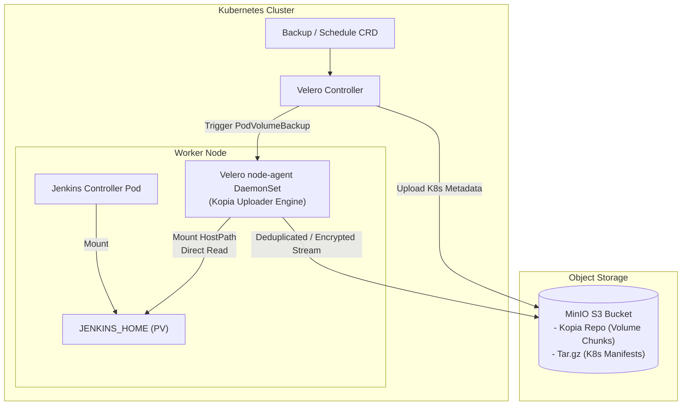
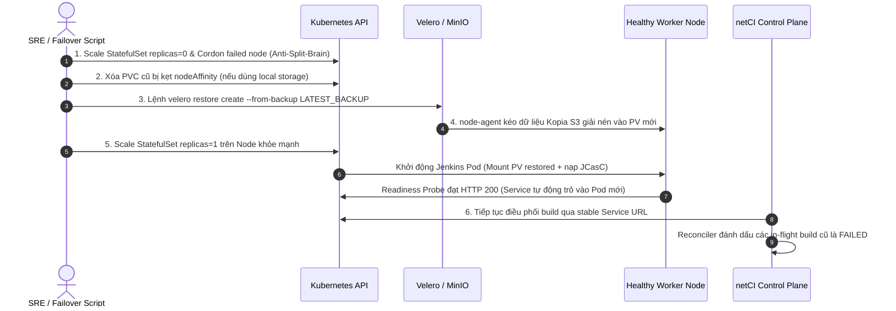

# Nghiên cứu Kiến trúc High Availability và Disaster Recovery cho Jenkins Controller trên Kubernetes

Tài liệu nghiên cứu kỹ thuật hỗ trợ cho quyết định kiến trúc tại [ADR-055: One Jenkins controller at a time; the standby is restored, not running](../decisions/ADR-055-one-jenkins-controller-at-a-time-restored-from-backup.md).


> **Đối chiếu với lab `netci-corp` (2026-09-26).** Phần thiết kế dưới đây viết cho môi trường
> công ty. Lab đang chạy khác ở những điểm sau, và chỉ những gì ghi ở đây là đã chạy thật:
>
> - **Object storage là SeaweedFS 4.47, không phải MinIO**: MinIO đã ngừng phát hành image
>   cộng đồng (`docker pull minio/minio` và `quay.io/minio/minio` đều thất bại). Velero chỉ
>   cần S3 API nên đổi sang SeaweedFS không ảnh hưởng gì đến thiết kế.
> - **S3 chạy HTTP trên docker bridge `172.17.0.1:8333`, chưa có TLS.** Mục TLS 1.3 bên dưới là
>   yêu cầu cho môi trường công ty, chưa được kiểm chứng trên lab.
> - **Drill failover đã PASS**: `scripts/corp/jenkins_failover.sh` cordon node đang chạy
>   controller, xoá namespace `jenkins`, rồi restore bằng Velero 1.18.3 + Kopia. Controller
>   chuyển từ worker3 sang worker2, build đánh dấu vẫn còn trong JENKINS_HOME. **RTO 84 s.**
>   RPO trong drill là 1 s vì backup được chụp ngay trước khi gây hỏng. Nếu mất node bất ngờ,
>   RPO tối đa bằng chu kỳ lịch backup (15 phút).
> - **Sự cố gặp phải:** SeaweedFS giới hạn 512 MiB bị OOM-kill khi Kopia upload song song.
>   Kopia chỉ thấy `connection reset`, còn Velero báo volume backup là `Canceled`. Đã nâng lên
>   1 GiB và đặt `GOMEMLIMIT`.
> - **Khoá repository Kopia:** mặc định Velero mã hoá repository bằng một mật khẩu hằng số đã
>   công bố (secret `velero-repo-credentials`). JENKINS_HOME chứa cả `credentials.xml` lẫn
>   `secrets/master.key` dùng để giải mã file đó, nên với khoá mặc định, ai đọc được bucket là
>   đọc được mọi credential của Jenkins. `infra/corp/velero/install.sh` giờ đặt khoá ngẫu nhiên
>   trước backup đầu tiên. Repository hiện có trên lab được khởi tạo trước bản sửa này và vẫn
>   dùng khoá mặc định cho tới khi được tạo lại.

---

## 1. Các tùy chọn HA/DR cho Jenkins Controller và Khuyến nghị từ Jenkins Project & CloudBees

### 1.1. Active-Passive vs. Active-Active

Trong các hệ thống phân tán, High Availability (HA) thường được triển khai theo hai mô hình chính:

*   **Active-Active:** Nhiều instance cùng hoạt động đồng thời, nhận tải song song qua Load Balancer. Khi một instance gặp sự cố, các instance còn lại tiếp tục xử lý công việc mà không làm gián đoạn hệ thống.
*   **Active-Passive (Active-Standby):** Chỉ duy nhất một instance (Primary/Active) xử lý tác vụ tại một thời điểm; instance thứ hai (Standby/Passive) ở trạng thái chờ sẵn hoặc được phục hồi khi Primary gặp sự cố (failover).

#### Kiến trúc CloudBees CI High Availability (Active-Active)
Trong phiên bản thương mại CloudBees CI trên nền tảng Kubernetes (Modern Platforms), CloudBees cung cấp tính năng **Active-Active HA** độc quyền cho Managed Controllers:
*   **Cơ chế hoạt động:** Nhiều bản sao (replicas) của controller chạy đồng thời sau Ingress/Load Balancer.
*   **Đồng bộ trạng thái:** CloudBees tích hợp **Hazelcast** làm mạng lưới in-memory data grid để đồng bộ hóa phiên làm việc, cache và khóa phân tán giữa các JVM của các bản sao.
*   **Lưu trữ dùng chung:** Toàn bộ bản sao cùng gắn kết vào một volume lưu trữ mạng hỗ trợ chế độ `ReadWriteMany` (RWX) như NFS hoặc AWS EFS.
*   **Ràng buộc công việc:** Chỉ hỗ trợ đầy đủ cho **Pipeline jobs** (Declarative hoặc Scripted). Các loại job cổ điển như **Freestyle** hoặc **Maven jobs không tương thích HA**; nếu bản sao đang chạy Freestyle job bị lỗi, build đó sẽ bị hủy và không được bản sao khác tiếp quản.

#### Kiến trúc CloudBees CI High Availability (Active-Passive)
Trên các hệ thống truyền thống (Traditional Platforms), CloudBees từng cung cấp mô hình **Active-Passive HA**:
*   Hai instance Jenkins cùng trỏ vào một thư mục `JENKINS_HOME` trên shared storage (NFS).
*   Chỉ có instance Active giữ file lock và nhận request HTTP. Instance Passive kiểm tra tín hiệu sống (heartbeat) định kỳ.
*   Khi failover xảy ra, instance Passive phải khởi động lại toàn bộ tiến trình nạp dữ liệu từ đĩa, dẫn đến downtime tương đương với một lần khởi động lại Jenkins thông thường (không đạt zero-downtime).

---

### 1.2. Tại sao Jenkins mã nguồn mở (Open-Source Jenkins) KHÔNG THỂ chạy 2 Controller trên cùng một JENKINS_HOME?

Dự án mã nguồn mở Jenkins (**Jenkins Project**) khẳng định rõ ràng: **Không hỗ trợ kiến trúc Active-Active hoặc chia sẻ `JENKINS_HOME` giữa nhiều controller**.

Nguyên nhân cốt lõi xuất phát từ kiến trúc lưu trữ nội tại của Jenkins core:
1.  **Mô hình lưu trữ In-Memory kết hợp File-Based Serialization:**
    *   Jenkins được thiết kế ban đầu như một ứng dụng đơn khối (monolith). Trạng thái của toàn bộ hệ thống (danh sách job, lịch sử build, cấu hình plugin, hàng đợi build) được nạp toàn bộ vào bộ nhớ heap của JVM khi khởi động và được lưu giữ trong RAM để phục vụ truy vấn tốc độ cao.
    *   Khi có thay đổi trạng thái, Jenkins tuần tự hóa (serialize) đối tượng Java trong bộ nhớ và ghi trực tiếp xuống các file XML trên đĩa (`config.xml`, `build.xml`, `queue.xml`) thông qua thư viện XStream.
2.  **Thiếu cơ chế Cache Coherence và Distributed Locking:**
    *   Jenkins core không có cơ chế truyền thông điệp (messaging bus) hay tầng cache phân tán (như Redis, Hazelcast) giữa các node.
    *   Nếu hai controller chạy độc lập cùng mount một thư mục `JENKINS_HOME`:
        *   **Xung đột ghi đồng thời (Concurrent Write Races):** Hai instance ghi đè cùng một file XML dẫn đến file bị cắt cụt (truncated) hoặc sai cú pháp XML.
        *   **Xung đột số hiệu build (Build Number Collision):** Cả hai controller cùng đọc file `nextBuildNumber` vào bộ nhớ, cùng phát hành chung một build ID cho hai lần chạy khác nhau, dẫn đến ghi đè thư mục kết quả trong `jobs/<job-name>/builds/<id>/`.
        *   **Hiện tượng bóng ma dữ liệu (Stale In-Memory State):** Controller A sửa đổi cấu hình job trên đĩa nhưng Controller B hoàn toàn không biết do không đọc lại từ đĩa, dẫn đến việc Controller B ghi đè cấu hình cũ ngược lại đĩa sau đó.
        *   **Xung đột khóa file (File Locks):** Quá trình xoay vòng log, ghi workspace và database nhúng (như H2 cho một số plugin) sẽ phát sinh lỗi khóa tài nguyên nghiêm trọng.
3.  **Kết luận từ Jenkins Project:** Mỗi Jenkins controller bắt buộc phải sở hữu một thư mục `JENKINS_HOME` chuyên biệt và tách biệt hoàn toàn. Việc cố tình chia sẻ `JENKINS_HOME` bằng NFS/SMB chắc chắn sẽ dẫn đến hỏng hóc dữ liệu vĩnh viễn (unrecoverable data corruption).

---

### 1.3. Cấu trúc `JENKINS_HOME`: Thành phần BẮT BUỘC sao lưu vs. Có thể bỏ qua

Thư mục `JENKINS_HOME` chứa cả dữ liệu cấu hình, dữ liệu trạng thái động và các tệp nhị phân tạm thời. Khi thiết kế sao lưu, cần phân định rạch ròi:

```text
JENKINS_HOME/
├── config.xml                     # Cấu hình toàn cục (Được JCasC quản lý)
├── credentials.xml                # Dữ liệu tài khoản đã mã hóa (BẮT BUỘC BACKUP nếu không dùng Vault)
├── secrets/                       # Khóa giải mã bí mật cốt lõi (BẮT BUỘC BACKUP TUYỆT ĐỐI)
│   ├── master.key                 # Khóa chủ mã hóa hudson.util.Secret
│   └── hudson.util.Secret         # Khóa dùng mã hóa toàn bộ secret trong credentials.xml
├── jobs/                          # Danh mục Jobs và lịch sử build (BẮT BUỘC BACKUP)
│   └── <JOB_NAME>/
│       ├── config.xml             # Cấu hình job
│       ├── nextBuildNumber        # Bộ đếm build
│       └── builds/                # Lịch sử và log các lần build
│           └── <BUILD_ID>/
│               ├── build.xml      # Metadata của build
│               └── log            # Console output
├── plugins/                       # File nhị phân plugin .jpi/.hpi (KHÔNG NÊN BACKUP - bake vào Image)
├── fingerprints/                  # Dấu vân tay artifact (Tùy chọn)
├── workspace/                     # Thư mục làm việc của pipeline (KHÔNG BACKUP - Ephemeral)
├── caches/ & war/                 # Bộ nhớ đệm và file giải nén (KHÔNG BACKUP)
```

#### Thành phần bắt buộc sao lưu:
1.  **`secrets/` (Đặc biệt là `master.key` và `hudson.util.Secret`):**
    *   `master.key`: Khóa bí mật dùng để giải mã khóa đối xứng `hudson.util.Secret`.
    *   `hudson.util.Secret`: Khóa mật mã chính mà Jenkins sử dụng để mã hóa toàn bộ token, mật khẩu, SSH private key trong hệ thống.
    *   *Cảnh báo an ninh:* Nếu mất thư mục `secrets/`, toàn bộ dữ liệu trong `credentials.xml` sẽ trở thành chuỗi ký tự vô nghĩa không thể giải mã. Ngược lại, nếu bản sao lưu của `secrets/` bị lộ lọt mà không được mã hóa, kẻ tấn công có thể giải mã toàn bộ bí mật của tổ chức.
2.  **`credentials.xml`:** Lưu trữ toàn bộ thông tin đăng nhập đã mã hóa của hệ thống.
3.  **`jobs/` (Lịch sử build và trạng thái công việc):**
    *   `jobs/<name>/builds/`: Chứa lịch sử thực thi, kết quả test, metadata và console log của các lần build.
    *   `jobs/<name>/nextBuildNumber`: Duy trì tính liên tục của định danh bản build.

#### Thành phần KHÔNG NÊN sao lưu:
1.  **`plugins/` vs. Rebuilt from Image:**
    *   Thư mục `plugins/` chứa các tệp nhị phân `.jpi` / `.hpi` có dung lượng từ hàng trăm megabyte đến hàng gigabyte.
    *   Sao lưu thư mục này gây phình to dung lượng backup, tốn I/O và băng thông mạng.
    *   **Khuyến nghị chuẩn:** Khóa danh sách plugin và phiên bản vào file `plugins.txt`, sử dụng công cụ chính thức `jenkins-plugin-cli` để cài đặt sẵn vào container image tại thời điểm build Dockerfile. Khi controller khởi động lại, toàn bộ plugin được nạp từ image bất biến (immutable image), đảm bảo tính nhất quán tuyệt đối và loại bỏ hoàn toàn rủi ro plugin drift.
2.  **`workspace/`:** Thư mục chứa mã nguồn checkout tạm thời của các job. Có dung lượng khổng lồ và mang tính chất tạm thời (ephemeral), bắt buộc phải loại bỏ khỏi backup.
3.  **`caches/`, `war/`, `*.log`:** Các tệp tạm phát sinh trong quá trình chạy của JVM.

---

### 1.4. JCasC (Jenkins Configuration as Code) loại bỏ những gì khỏi phạm vi sao lưu?

Plugin **Jenkins Configuration as Code (JCasC)** cho phép định nghĩa toàn bộ cấu hình controller dưới dạng một tệp khai báo YAML duy nhất (`jenkins.yaml`), lưu trữ an toàn trong kho mã nguồn Git.

JCasC giúp loại bỏ hoàn toàn các tệp cấu hình tĩnh sau đây khỏi phạm vi cần sao lưu:
*   `config.xml`: Cấu hình hệ thống chung (System Message, URL, Executor count, Cloud Configuration như Kubernetes Plugin Cloud provider).
*   Cấu hình an ninh (`security.xml`, Security Realm như SAML/OIDC/LDAP, Authorization Strategy như Role-Based Strategy hoặc Matrix Authorization).
*   Cấu hình công cụ toàn cục (`hudson.tasks.Maven.xml`, `jenkins.plugins.git.GitTool.xml`, cấu hình JDK, Node.js).
*   Cấu hình các plugin tích hợp (SonarQube, Slack, Artifact Repository, Mailer).
*   Giao diện hiển thị (Views, Dashboards).

**Hệ quả đối với kiến trúc DR (theo tinh thần ADR-055):**
> *"Configuration is code (JCasC); only history is data."*
Khi áp dụng JCasC, controller có thể được dựng mới từ Git repository bất kỳ lúc nào mà không cần khôi phục cấu hình hệ thống từ backup. Backup của `JENKINS_HOME` chỉ còn duy nhất một nhiệm vụ: **bảo toàn dữ liệu lịch sử chạy build (`jobs/`) và khóa giải mã bí mật (`secrets/`)**.

---

## 2. Velero: File-System Backup (Kopia Uploader) vs. CSI Snapshots trên Kubernetes

Velero (dự án thuộc CNCF) là công cụ tiêu chuẩn để sao lưu, phục hồi và chuyển dịch tài nguyên cụm Kubernetes cùng các Persistent Volumes (PV).



### 2.1. File-System Backup (FSB) với Kopia Uploader vs. CSI Snapshots

Velero cung cấp hai cơ chế cốt lõi để bảo vệ dữ liệu volume:

| Tiêu chí | File-System Backup (FSB) với Kopia | CSI Snapshots (VolumeSnapshot) |
| :--- | :--- | :--- |
| **Bản chất kỹ thuật** | Đọc dữ liệu ở mức hệ thống tệp (File-level) trực tiếp từ volume đang mount. | Chụp ảnh nhanh ở mức khối (Block-level) thông qua Container Storage Interface (CSI). |
| **Tính độc lập hạ tầng (Agnostic)** | **Hoàn toàn độc lập** với StorageClass; hoạt động với local-path, NFS, HostPath, Ceph, EBS, v.v. | **Phụ thuộc chặt chẽ** vào CSI Driver của nhà cung cấp lưu trữ (yêu cầu hỗ trợ `VolumeSnapshotClass`). |
| **Tính nhất quán dữ liệu** | Đọc tệp trực tiếp khi ứng dụng đang chạy; cần dùng hook (freeze/quiesce) để đạt tính nhất quán. | Tính nhất quán tức thời (Point-in-time crash-consistent) tại thời điểm gọi lệnh snapshot của storage. |
| **Đưa dữ liệu ra Object Storage** | Tự động chunking, deduplicate, nén và đẩy trực tiếp lên S3/MinIO. | Snapshot mặc định nằm tại Storage Provider; cần cấu hình thêm Velero CSI Data Mover để copy snapshot ra S3. |
| **Phù hợp cho Jenkins** | **Rất phù hợp** cho cụm bare-metal/on-premise sử dụng local storage hoặc NFS chia sẻ. | Phù hợp khi chạy trên Managed Cloud (EBS, GPD) có sẵn CSI snapshot driver. |

---

### 2.2. Cơ chế hoạt động của `node-agent`

*   `node-agent` (trước đây gọi là Restic DaemonSet) chạy dưới dạng một **Kubernetes DaemonSet** trên tất cả các worker node trong cụm.
*   Để đọc được dữ liệu của `JENKINS_HOME`, `node-agent` mount thư mục gốc của kubelet trên host node (thường là `/var/lib/kubelet/pods`) với cờ `MountPropagation: HostToContainer` (hoặc `Bidirectional`).
*   Khi có yêu cầu backup, Velero Controller tạo ra một Custom Resource `PodVolumeBackup`. `node-agent` trên node tương ứng phát hiện CR này, xác định vị trí mount của PV thuộc pod Jenkins, kích hoạt tiến trình Kopia nhúng để tính toán deduplication, nén và truyền trực tiếp dữ liệu lên S3 repository.

---

### 2.3. Lập lịch (Schedules) và Quản lý Vòng đời

Velero hỗ trợ CRD `Schedule` với cú pháp Cron tiêu chuẩn:
```yaml
apiVersion: velero.io/v1
kind: Schedule
metadata:
  name: jenkins-backup-15m
  namespace: velero
spec:
  schedule: "*/15 * * * *"
  template:
    includedNamespaces:
      - jenkins
    defaultVolumesToFsBackup: true
    ttl: 168h0m0s   # Giữ lại bản backup trong 7 ngày
```
*   `defaultVolumesToFsBackup: true` chỉ thị cho Velero tự động sử dụng Kopia FSB cho toàn bộ pod volume trong namespace mà không cần gắn annotation thủ công vào từng pod.
*   `ttl` (Time-To-Live) tự động kích hoạt bộ dọn dẹp xóa các bản backup cũ trên S3 MinIO khi hết hạn.

---

### 2.4. Khôi phục sang Node hoặc Namespace khác

1.  **Khôi phục sang Namespace khác (Namespace Mapping):**
    Velero hỗ trợ tham số `--namespace-mappings` (hoặc trường `namespaceMapping` trong CRD `Restore`):
    ```bash
    velero restore create jenkins-drill-restore \
      --from-backup jenkins-backup-15m-20260926090000 \
      --namespace-mappings jenkins:jenkins-drill
    ```
    Toàn bộ tài nguyên Kubernetes (StatefulSet, Service, Secrets, PVC) sẽ được tạo mới trong namespace đích `jenkins-drill`, đồng thời dữ liệu volume được kéo từ Kopia repository về volume mới tương ứng.
2.  **Khôi phục sang Node khác trong cụm:**
    Khi worker node cũ bị chết hoàn toàn, Kubernetes Scheduler sẽ xếp lịch cho Pod mới chạy trên một worker node khỏe mạnh. Velero khôi phục lại PVC; StorageClass (như Local Path hoặc CSI) cấp phát volume mới trên node mục tiêu. `node-agent` trên node mới sẽ mount volume này và phục hồi toàn bộ dữ liệu từ MinIO S3 về trước khi pod Jenkins chuyển sang trạng thái `Running`.

---

### 2.5. Velero Hooks (fsfreeze / Pre-Post Exec) đảm bảo tính nhất quán của `JENKINS_HOME`

Do File-System Backup đọc tệp trực tiếp khi Jenkins đang ghi log hoặc cập nhật XML, nguy cơ tệp bị rách (torn read / partial write) có thể xảy ra nếu không có cơ chế đóng băng (quiesce).

Velero cung cấp cơ chế **Backup Hooks** (Pre-hook và Post-hook) thực thi trực tiếp bên trong container:

```yaml
apiVersion: apps/v1
kind: StatefulSet
metadata:
  name: jenkins
  namespace: jenkins
spec:
  template:
    metadata:
      annotations:
        # Pre-hook: Đóng băng filesystem hoặc bật chế độ Quiet Down
        pre.hook.backup.velero.io/container: jenkins
        pre.hook.backup.velero.io/command: '["/bin/sh", "-c", "sync"]'
        pre.hook.backup.velero.io/timeout: "30s"
        pre.hook.backup.velero.io/on-error: "Fail"
        # Post-hook: Thực thi sau khi snapshot volume hoàn tất
        post.hook.backup.velero.io/container: jenkins
        post.hook.backup.velero.io/command: '["/bin/sh", "-c", "echo backup completed"]'
        post.hook.backup.velero.io/timeout: "30s"
```

*   **Phương án `fsfreeze`:** Yêu cầu container chạy với đặc quyền `CAP_SYS_ADMIN` và Linux mount hỗ trợ freeze (`fsfreeze --freeze /var/jenkins_home`). Sau khi Velero hoàn tất quét metadata, post-hook thực thi `fsfreeze --unfreeze /var/jenkins_home`.
*   **Phương án Application-level (Quiet Down):** Gọi lệnh `jenkins-cli quiet-down` trong pre-hook để yêu cầu Jenkins ngừng nhận job mới và xả bộ đệm xuống đĩa, sau đó `jenkins-cli cancel-quiet-down` trong post-hook.

---

### 2.6. Hạn chế kỹ thuật: `hostPath` vs. `local-path`

*   **`hostPath` Volumes:** Velero File-System Backup **chính thức KHÔNG hỗ trợ sao lưu trực tiếp các volume dạng `hostPath` thuần túy** (không qua PVC). `hostPath` bỏ qua tầng trừu tượng PersistentVolume/PersistentVolumeClaim của Kubernetes, khiến Velero không thể quản lý vòng đời và ánh xạ volume khi restore.
*   **`local-path` Provisioner (Local PV):**
    *   Được hỗ trợ đầy đủ bởi Velero FSB.
    *   *Ràng buộc cần lưu ý:* Local PV có thuộc tính `nodeAffinity` gắn chặt với một node vật lý cụ thể. Nếu node đó bị phá hủy, PV cũ sẽ bị kẹt không thể mount ở node khác.
    *   *Giải pháp khi restore:* Velero không cố gắng mount lại PV cũ của node đã chết, mà khởi tạo một PVC mới. StorageClass `local-path` trên node khỏe mạnh sẽ cấp phát một thư mục lưu trữ mới trên node đó, và `node-agent` sẽ bơm toàn bộ dữ liệu từ Kopia repository vào thư mục mới này.
    *   *Ràng buộc Pod đính kèm:* Velero FSB bắt buộc volume phải đang được mount bởi một Pod đang hoạt động tại thời điểm backup. Không thể sao lưu một PVC "mồ côi" (orphaned PVC) không có pod nào mount.

---

## 3. Kopia Standalone vs. Velero + Kopia, Restic Deprecation và Các Giải pháp Thay thế

### 3.1. Kopia Standalone vs. Kopia qua Velero

| Tiêu chí | Kopia Standalone | Velero kết hợp Kopia Uploader |
| :--- | :--- | :--- |
| **Phạm vi quản lý** | Chỉ quản lý tệp và thư mục trên hệ thống tệp. | Quản lý toàn diện: Cả tệp trên PV lẫn Manifests Kubernetes (StatefulSet, Service, Secrets, RBAC, PVC). |
| **Tích hợp Kubernetes** | Không có (Unaware). Cần tự viết script, CronJob, quản lý kubeconfig và mount thủ công. | Kubernetes-native thông qua Custom Resource Definitions (`Backup`, `Restore`, `Schedule`). |
| **Khử trùng lặp & Nén** | Rất mạnh: Content-defined chunking (FastCDC), nén ZSTD, S2, GZIP. | Kế thừa 100% engine FastCDC và các thuật toán nén hiện đại của Kopia. |
| **Bảo mật** | Mã hóa End-to-End phía client (AES-256-GCM, ChaCha20-Poly1305). | Kopia repository được mã hóa bằng mật khẩu quản lý qua Kubernetes Secret. |
| **Khả năng khôi phục sau thảm họa** | Phải tự tạo lại namespace, apply manifests bằng kubectl, sau đó kéo data về. | **Một lệnh duy nhất** khôi phục cả cấu hình hạ tầng mạng, secret lẫn dữ liệu volume. |

---

### 3.2. Lộ trình Khai tử (Deprecation Timeline) của Restic trong Velero

Velero đã chính thức công bố lộ trình thay thế hoàn toàn Restic bằng Kopia:

*   **Velero v1.10:** Kopia được giới thiệu lần đầu và trở thành uploader mặc định cho File-System Backup nhờ hiệu năng vượt trội, hỗ trợ đa luồng và tính ổn định cao.
*   **Velero v1.15 & v1.16:** Restic chính thức bị đánh dấu **Deprecated**. Việc sử dụng `--uploader-type=restic` vẫn hoạt động nhưng hiển thị cảnh báo cảnh báo rủi ro (warnings). Cờ `--use-restic` bị thay thế hoàn toàn bằng `--use-node-agent`.
*   **Velero v1.17 & v1.18:** Tính năng tạo bản sao lưu mới bằng Restic bị vô hiệu hóa hoàn toàn (`Backup disabled`). Người dùng chỉ còn quyền khôi phục (`Restore only`) từ các bản backup Restic đã tồn tại trước đó.
*   **Velero v1.19+:** Mã nguồn Restic bị gỡ bỏ hoàn toàn khỏi Velero (`Fully disabled`). Các bản backup tạo bằng Restic sẽ không thể khôi phục trên phiên bản này.

> **Khẳng định kiến trúc:** Mọi thiết kế mới cho netCI tuyệt đối không sử dụng Restic, bắt buộc triển khai Kopia uploader thông qua `velero install --use-node-agent`.

---

### 3.3. So sánh các Giải pháp Thay thế (One-line Trade-offs)

1.  **Kasten K10 (by Veeam):** Nền tảng sao lưu Kubernetes cấp doanh nghiệp mạnh mẽ với giao diện UI xuất sắc và hỗ trợ application-consistent thông qua Kanister, nhưng là phần mềm thương mại trả phí bản quyền đắt đỏ và quá nặng nề cho các cụm lab/on-premise vừa và nhỏ.
2.  **Stash / KubeStash (AppsCode):** Công cụ backup Kubernetes-native mạnh mẽ, hỗ trợ nhiều backend lưu trữ đa dạng thông qua CRD chi tiết, nhưng cấu hình ban đầu phức tạp, khó gỡ lỗi và tài liệu kỹ thuật bị phân mảnh giữa phiên bản Stash cũ và KubeStash mới.
3.  **Longhorn Backups (Rancher / SUSE):** Giải pháp sao lưu tích hợp trực tiếp ở mức block storage phân tán cho phép đẩy snapshot trực tiếp lên S3 với hiệu năng cao, nhưng bị khóa chặt (vendor lock-in) vào hạ tầng lưu trữ Longhorn và hoàn toàn không tự sao lưu các Kubernetes manifests/secrets.
4.  **thinBackup Plugin (Jenkins Native):** Plugin Jenkins gọn nhẹ chạy trực tiếp trong JVM giúp định kỳ sao lưu các tệp cấu hình XML, nhưng hoàn toàn vô dụng nếu controller chết hoặc đĩa lưu trữ bị hỏng, không thể tự phục hồi hạ tầng Kubernetes và không có cơ chế snapshot nguyên tử (atomic).

---

## 4. Thiết kế Kiến trúc Đề xuất: Cụm 3 Control-plane + 3 Worker với MinIO S3

Theo đề xuất tại **ADR-055**, mô hình chuẩn cho netCI là **"One active, standby restored"**: Chỉ duy nhất một Jenkins controller hoạt động tại một thời điểm dưới dạng StatefulSet (replica=1), controller dự phòng không chạy nền mà sẽ được khôi phục tức thì từ bản sao lưu gần nhất khi xảy ra thảm họa.

```text
[Control Plane: 3 Nodes] ---> etcd Quorum (Fault Tolerance: 1 Node Failure)
                                   |
[Worker Pool: 3 Nodes]       Node 1 (Worker)        Node 2 (Worker)        Node 3 (Worker)
                             +----------------+     +----------------+     +----------------+
                             | Jenkins Master |     | Ephemeral Pod  |     | MinIO Cluster  |
                             | (Active, 1-rep)|     | CI Build Agent |     | (S3 Endpoint)  |
                             | [PVC: J_HOME]  |     +----------------+     +----------------+
                             | node-agent     |     | node-agent     |     | node-agent     |
                             +----------------+     +----------------+     +----------------+
                                     |                                             ^
                                     +========= (Kopia FSB Stream via TLS) ========+
```

### 4.1. Mục tiêu RPO và RTO

*   **RPO (Recovery Point Objective) ≤ 15 phút:**
    *   Lịch sao lưu Velero được thiết lập chạy định kỳ **15 phút/lần**.
    *   Trong trường hợp thảm họa xấu nhất (worker node chết đột ngột), lượng dữ liệu lịch sử build tối đa bị mất là 15 phút.
    *   Toàn bộ cấu hình hệ thống, pipeline definition và credentials không bị mất vì đã được quản lý bất biến bằng **JCasC trong Git** và Secret manifests.
*   **RTO (Recovery Time Objective) ≤ 5 - 10 phút:**
    *   Thời gian phát hiện sự cố và cô lập node: ~1 phút.
    *   Thời gian Velero restore volume metadata và kéo tệp từ MinIO nội bộ: ~2 - 4 phút (với dung lượng dữ liệu tinh gọn loại bỏ plugins/workspaces).
    *   Thời gian Pod khởi động, nạp JCasC và sẵn sàng phục vụ (`Ready` probe): ~1 - 2 phút.

---

### 4.2. Lập lịch Sao lưu và Chính sách Lưu trữ (Retention)

1.  **Lập lịch định kỳ:**
    *   `Schedule` 15 phút (`*/15 * * * *`) sao lưu namespace `jenkins` với `ttl: 168h0m0s` (lưu trữ 7 ngày).
    *   `Schedule` hàng ngày lúc 01:00 AM (`0 1 * * *`) với `ttl: 720h0m0s` (lưu trữ 30 ngày) phục vụ mục đích kiểm toán dài hạn.
2.  **Sao lưu trước bảo trì (Pre-maintenance Snapshot):**
    *   Tự động kích hoạt lệnh `velero backup create pre-upgrade-...` trước mỗi lần nâng cấp image Jenkins, cập nhật phiên bản plugin hoặc thay đổi cấu hình hạ tầng.
3.  **Bảo trì Repository (Kopia Maintenance):**
    *   Thiết lập Kopia maintenance tự động định kỳ (mặc định của Velero) để dọn dẹp các khối dữ liệu mồ côi (blob garbage collection) trên bucket MinIO, tối ưu dung lượng lưu trữ.

---

### 4.3. Kiến trúc Bảo mật và Mã hóa (Encryption)

1.  **Mã hóa trên đường truyền (In-transit Encryption):**
    *   Bắt buộc kích hoạt TLS 1.3 giữa `node-agent` của Velero và endpoint MinIO S3 (`https://minio.netci-storage.svc:9000`).
2.  **Mã hóa dữ liệu nghỉ (At-rest Encryption):**
    *   **Kopia Client-side Encryption:** Kopia repository được khởi tạo với thuật toán mã hóa đối xứng tiêu chuẩn `AES-256-GCM` hoặc `ChaCha20-Poly1305`. Khóa mã hóa repository được cung cấp qua Kubernetes Secret `velero-repo-credentials`, đảm bảo ngay cả khi bucket MinIO bị lộ lọt, dữ liệu `JENKINS_HOME` vẫn được bảo vệ tuyệt đối.
    *   **MinIO Server-Side Encryption (SSE-S3 / SSE-KMS):** Tích hợp khóa KMS hoặc khóa nội bộ của MinIO để mã hóa hai lớp trên ổ đĩa vật lý của cụm storage.

---

### 4.4. Quy trình Diễn tập Phục hồi Thảm họa (DR Drill)

Để đảm bảo các bản backup không rơi vào tình trạng "sao lưu thành công nhưng không thể phục hồi", quy trình diễn tập tự động (Drill) được thiết lập định kỳ hàng tháng hoặc tích hợp vào pipeline kiểm thử:

1.  **Tạo môi trường diễn tập:** Khởi tạo namespace tạm thời `jenkins-drill`.
2.  **Thực thi phục hồi:** Sử dụng bản backup gần nhất của production để restore sang namespace `jenkins-drill` qua tham số `--namespace-mappings jenkins:jenkins-drill`.
3.  **Khởi động và Kiểm chứng tính toàn vẹn:**
    *   Kiểm tra Kubernetes Readiness/Liveness probe trả về HTTP 200 trên endpoint `/login`.
    *   Gọi API `/api/json` kiểm tra danh mục jobs và lịch sử các lần build trước đó.
    *   Thực hiện test giải mã credentials: Chạy một job thử nghiệm sử dụng credential có sẵn để đảm bảo cặp khóa `master.key` và `hudson.util.Secret` được nạp chính xác.
4.  **Đo đạc và Thu thập Evidence:** Ghi nhận thời gian RTO thực tế, đối chiếu dữ liệu và xuất file bằng chứng vào thư mục `evidence/` trước khi xóa bỏ namespace `jenkins-drill`.

---

### 4.5. Trình tự Kịch bản Failover Chuẩn xác: "One Active, Standby Restored"

Khi worker node chạy Jenkins Active gặp sự cố phần cứng hoặc kernel panic, quy trình chuyển đổi dự phòng được thực hiện theo đúng 6 bước nghiêm ngặt sau:



*   **Bước 1: Phát hiện sự cố và Cô lập triệt để (Anti-Split-Brain Fencing):**
    *   Giám sát xác nhận controller cũ không còn phản hồi.
    *   Lập tức scale StatefulSet về 0 để hạ gục pod cũ:
        ```bash
        kubectl scale statefulset jenkins -n jenkins --replicas=0
        ```
    *   Nếu node vật lý gặp lỗi mạng (network partition), thực hiện `kubectl cordon <failed-node>` và cưỡng chế xóa Pod (`kubectl delete pod jenkins-0 -n jenkins --force --grace-period=0`). Biện pháp này đảm bảo hai pod Jenkins không bao giờ cùng chạy song song và tranh chấp ghi dữ liệu.
*   **Bước 2: Xử lý Tầng Lưu trữ (Storage Preparation):**
    *   Nếu sử dụng Local PV gắn chặt với node cũ, xóa bỏ PVC cũ để tránh pod bị kẹt ở trạng thái `Pending` do `nodeAffinity`:
        ```bash
        kubectl delete pvc jenkins-home -n jenkins
        ```
*   **Bước 3: Thực thi Velero Restore:**
    *   Truy vấn bản sao lưu thành công mới nhất từ MinIO:
        ```bash
        LATEST_BACKUP=$(velero backup get -n velero --selector app=jenkins --sort-by=.metadata.creationTimestamp -o jsonpath='{.items[-1].metadata.name}')
        ```
    *   Kích hoạt tiến trình khôi phục:
        ```bash
        velero restore create --from-backup $LATEST_BACKUP \
          --include-namespaces jenkins \
          --restore-volumes=true \
          --wait
        ```
    *   `node-agent` trên worker node khỏe mạnh sẽ mount volume mới được cấp phát và giải nén toàn bộ `JENKINS_HOME` từ Kopia repository trên MinIO.
*   **Bước 4: Khởi động Controller và Áp dụng JCasC:**
    *   Nâng số lượng bản sao lên 1:
        ```bash
        kubectl scale statefulset jenkins -n jenkins --replicas=1
        ```
    *   Container khởi động: nạp mã nguồn từ image bất biến, đọc khóa `master.key` từ thư mục `secrets/` đã khôi phục, tự động nạp cấu hình chuẩn từ ConfigMap JCasC (`jenkins.yaml`).
*   **Bước 5: Kiểm tra Sức khỏe và Chuyển hướng Lưu lượng:**
    *   Kubernetes Readiness Probe kiểm tra thành công HTTP 200 trên endpoint `/login`.
    *   Kubernetes Service `jenkins.jenkins.svc.cluster.local` tự động gắn endpoint của pod mới.
    *   Do netCI Router luôn trỏ vào URL ổn định của Service, netCI không cần phải thay đổi cấu hình hay cập nhật DNS.
*   **Bước 6: Đối chiếu Trạng thái (Reconciliation) và Đo đạc RTO:**
    *   Hệ thống ghi nhận thời gian phục hồi (RTO) thực tế vào bảng audit log.
    *   Bộ đối chiếu của netCI quét danh sách các build đang dang dở để xử lý dọn dẹp.

---

## 5. Số phận của các Build đang chạy và Agent Pods (Kubernetes Plugin) khi Failover

Một câu hỏi cốt lõi trong thiết kế HA/DR là: **Điều gì sẽ xảy ra với các build đang chạy dở và các Pod agent khi controller bị sập?**

### 5.1. Vòng đời của Agent Pods (Jenkins Kubernetes Plugin)

*   Jenkins Kubernetes Plugin hoạt động theo cơ chế **ephemeral agents** (pod theo nhu cầu): Khi có một job trong hàng đợi, controller gọi Kubernetes API để khởi tạo một Pod agent chuyên biệt trong namespace chỉ định (`jenkins` hoặc `netci-build`).
*   Trong Pod agent, container `jnlp` (hoặc `inbound-agent`) mở một kết nối hai chiều (TCP hoặc WebSocket Remoting) hướng về cổng kết nối của controller (`50000/TCP` hoặc qua HTTP/WebSocket).
*   Các chỉ lệnh thực thi của Pipeline (như lệnh `sh`, checkout Git, build Docker) được gửi tuần tự qua kênh remoting này.

---

### 5.2. Hiện tượng xảy ra tại thời điểm Controller gặp sự cố

1.  **Mất kết nối Remoting:**
    *   Khi controller pod bị tắt hoặc node bị chết, kết nối TCP/WebSocket từ agent pod lập tức bị đứt.
    *   Tiến trình `inbound-agent` rơi vào trạng thái chờ và liên tục thử kết nối lại (reconnect loop) cho đến khi đạt ngưỡng thời gian chờ (`retry-count` hoặc timeout).
2.  **Mất ngữ cảnh thực thi trong JVM (In-Memory CPS State Destruction):**
    *   Pipeline trong Jenkins được thực thi bởi máy ảo Groovy CPS (Continuation Passing Style) chạy trực tiếp trong bộ nhớ heap của controller JVM.
    *   Khi tiến trình Java của controller bị hủy diệt, toàn bộ trạng thái luồng (threads), con trỏ bước thực thi (program counters) và biến môi trường trong RAM bị biến mất hoàn toàn.
    *   Dù container của agent có thể vẫn đang chạy dở một lệnh shell nhị phân độc lập, kết quả đầu ra (stdout/stderr) và mã thoát (exit code) của lệnh đó không còn đích đến để tiếp nhận.

---

### 5.3. Trạng thái sau khi Phục hồi Controller (Restored Controller State)

1.  **Không thể "Nhận nuôi" (Cannot Adopt Orphaned Agents):**
    *   Khi controller mới được dựng lại từ bản backup của Velero và khởi động JVM mới, ID của phiên làm việc (Session ID / Channel ID) đã hoàn toàn thay đổi.
    *   Các agent pod cũ đang chạy trên cụm không thể bắt tay (handshake) với JVM mới. Controller mới coi những kết nối từ agent cũ là không hợp lệ và từ chối kết nối.
2.  **Đánh dấu Build FAILED / ABORTED trên đĩa:**
    *   Khi controller mới đọc lại thư mục `jobs/<name>/builds/<id>/` từ dữ liệu volume vừa restore, nó quét các tệp `build.xml`.
    *   Những bản build chưa ghi nhận thẻ kết thúc `<result>` trước thời điểm backup sẽ được hệ thống phát hiện là bị gián đoạn giữa chừng.
    *   Jenkins tự động đánh dấu kết quả build là **`ABORTED`** hoặc **`FAILED`** với thông báo lỗi hệ thống:
        > *"Build was interrupted: Controller was shut down / restarted unexpectedly."*
    *   Những bản build được kích hoạt trong khoảng thời gian giữa lần backup cuối cùng và lúc sập (trong phạm vi RPO 15 phút) sẽ hoàn toàn không tồn tại trong lịch sử của controller mới.

---

### 5.4. Xử lý Agent Pods Mồ côi (Orphaned Pod Garbage Collection)

*   Các agent pod bị bỏ lại trên cụm Kubernetes sẽ trở thành các pod mồ côi (orphaned pods).
*   Nếu không dọn dẹp, chúng sẽ chiếm dụng CPU/RAM và địa chỉ IP trong cluster pod CIDR.
*   **Cơ chế dọn dẹp:**
    *   *Tự hủy theo thời hạn:* Cấu hình pod template luôn thiết lập tham số `activeDeadlineSeconds` (ví dụ 3600s) để Kubernetes tự động thu hồi pod nếu quá thời gian.
    *   *Jenkins Kubernetes Plugin Reaper:* Khi controller khởi động lại, tác vụ định kỳ của Kubernetes plugin sẽ truy vấn danh sách pod có nhãn `jenkins/role=agent` và so khớp với danh sách agent đang hoạt động; các pod không thuộc phiên hiện tại sẽ bị gọi lệnh xóa qua API.
    *   *netCI Platform Reaper:* Trong kịch bản failover khẩn cấp, script `jenkins_failover.sh` chủ động dọn dẹp sạch sẽ:
        ```bash
        kubectl delete pods -n jenkins -l jenkins/role=agent --wait=false
        ```

---

### 5.5. Hợp đồng của netCI Platform: Chống "False Green" và Cho phép Retry

Quy định tại **ADR-055** nêu rõ nguyên tắc xử lý của netCI đối với các build bị gián đoạn:

1.  **Phát hiện đứt gãy:** Bộ đối chiếu (Reconciler) của netCI liên tục thăm dò trạng thái các `pipeline_runs` đang chạy. Khi controller phục hồi, reconciler nhận thấy các run ID này hoặc trả về lỗi `ABORTED` từ Jenkins, hoặc biến mất hoàn toàn (HTTP 404).
2.  **Quyết định trạng thái dứt khoát:**
    *   Sau thời gian timeout quy định, netCI cập nhật trạng thái của `pipeline_run` thành **`FAILED`** kèm nguyên nhân rõ ràng: `CONTROLLER_FAILOVER_ABORTED`.
    *   **Nguyên tắc vàng:** netCI **tuyệt đối không bao giờ báo một build bị mất là `SUCCEEDED`** (chống lỗi báo xanh giả mạo - false green).
3.  **Khả năng thử lại (Idempotent Retry):**
    *   Nhờ cơ chế bất biến của netCI (mỗi build gắn chặt với Git commit SHA và artifact digest), người dùng hoặc webhook có thể an toàn kích hoạt chạy lại (retry) pipeline run đó từ đầu trên controller mới mà không sợ xung đột trạng thái.

---

## 6. Khuyến nghị (Recommendations)

Từ các phân tích chuyên sâu trên, nhóm kiến trúc netCI đưa ra 5 khuyến nghị cốt lõi:

1.  **Duy trì triệt để mô hình "One Active, Standby Restored" (ADR-055):**
    *   Không cố gắng xây dựng giải pháp Active-Active cho open-source Jenkins bằng cách mount chung NFS. Điều này trái với khuyến nghị của Jenkins Project và chắc chắn gây hỏng dữ liệu.
    *   Mô hình một controller Active duy nhất mang lại sự đơn giản, an toàn dữ liệu, tránh split-brain và tối ưu hóa tài nguyên phần cứng.
2.  **Áp dụng nghiêm ngặt JCasC kết hợp Immutable Container Image:**
    *   Loại bỏ hoàn toàn thư mục `plugins/` khỏi phạm vi sao lưu; đóng gói toàn bộ plugin vào container image.
    *   Loại bỏ toàn bộ cấu hình hệ thống khỏi phạm vi sao lưu; quản lý 100% bằng code YAML trong Git qua JCasC.
    *   Phạm vi sao lưu duy nhất cần tập trung là: `jobs/` (lịch sử build) và `secrets/` (`master.key`, `hudson.util.Secret`).
3.  **Chuẩn hóa Giải pháp Sao lưu trên Velero với Kopia Uploader:**
    *   Tuyệt đối không dùng Restic do đã bị khai tử trong Velero.
    *   Cấu hình `Schedule` 15 phút sử dụng Kopia File-System Backup hướng về MinIO S3 nội bộ.
    *   Thiết lập Backup Pre/Post Exec Hooks để đồng bộ đĩa hoặc bật chế độ quiet-down, bảo đảm tính toàn vẹn dữ liệu cho các file XML.
4.  **Tự động hóa Quy trình Failover và Diễn tập Định kỳ:**
    *   Hiện thực hóa script chuyển đổi dự phòng `scripts/corp/jenkins_failover.sh` với cơ chế fencing triệt để (scale 0, cordon node) trước khi khôi phục.
    *   Thực hiện diễn tập phục hồi (DR Drill) định kỳ hàng tháng sang namespace độc lập để kiểm chứng RTO (đạt mục tiêu ≤ 5 - 10 phút) và kiểm tra khả năng giải mã credentials.
5.  **Thiết kế netCI Reconciler tuân thủ nguyên tắc Fail-Safe:**
    *   Chấp nhận rằng các in-flight build tại thời điểm thảm họa là không thể phục hồi do giới hạn kiến trúc remoting của Jenkins.
    *   netCI Reconciler phải tự động phát hiện các build bị gián đoạn, ghi nhận trạng thái `FAILED`, dọn dẹp agent mồ côi và cho phép thực hiện retry an toàn.

---

## 7. Bảng Nguồn Tham khảo (Table of Sources)

Tất cả các khẳng định kỹ thuật trong tài liệu này đều được trích xuất và đối chiếu từ tài liệu chính thức của các dự án công nghệ:

| Thành phần / Chủ đề | Tiêu đề Tài liệu / Nguồn | URL Chính thức |
| :--- | :--- | :--- |
| **Jenkins Core** | Backing-up/Restoring Jenkins (User Handbook) | [https://www.jenkins.io/doc/book/system-administration/backing-up/](https://www.jenkins.io/doc/book/system-administration/backing-up/) |
| **Jenkins Core** | System Administration Guide: Managing JENKINS_HOME | [https://www.jenkins.io/doc/book/system-administration/](https://www.jenkins.io/doc/book/system-administration/) |
| **CloudBees CI** | CloudBees CI High Availability (Active-Active) Architecture | [https://docs.cloudbees.com/docs/cloudbees-ci/latest/ha/](https://docs.cloudbees.com/docs/cloudbees-ci/latest/ha/) |
| **CloudBees CI** | Backup and Restore Best Practices for Jenkins Controllers | [https://docs.cloudbees.com/docs/cloudbees-ci/latest/backup-restore/](https://docs.cloudbees.com/docs/cloudbees-ci/latest/backup-restore/) |
| **Jenkins JCasC** | Jenkins Configuration as Code (JCasC) Plugin Documentation | [https://plugins.jenkins.io/configuration-as-code/](https://plugins.jenkins.io/configuration-as-code/) |
| **Jenkins K8s** | Jenkins Kubernetes Plugin Architecture & Ephemeral Agents | [https://plugins.jenkins.io/kubernetes/](https://plugins.jenkins.io/kubernetes/) |
| **Jenkins Backup** | Jenkins thinBackup Plugin Documentation & Limitations | [https://plugins.jenkins.io/thinBackup/](https://plugins.jenkins.io/thinBackup/) |
| **Velero** | Velero File System Backup (FSB) with Kopia | [https://velero.io/docs/v1.18/file-system-backup/](https://velero.io/docs/v1.18/file-system-backup/) |
| **Velero** | Velero Backup Hooks Reference (Pre/Post Exec Hooks) | [https://velero.io/docs/v1.18/backup-hooks/](https://velero.io/docs/v1.18/backup-hooks/) |
| **Velero** | Restic Deprecation (section of the v1.18 File System Backup page) | [https://velero.io/docs/v1.18/file-system-backup/](https://velero.io/docs/v1.18/file-system-backup/) |
| **Velero** | Velero Restore Reference: Namespace Mappings | [https://velero.io/docs/v1.18/restore-reference/](https://velero.io/docs/v1.18/restore-reference/) |
| **Velero** | Node-agent concurrency and data-path configuration | [https://velero.io/docs/v1.18/node-agent-concurrency/](https://velero.io/docs/v1.18/node-agent-concurrency/) |
| **Kopia** | Kopia Architecture: Repositories & S3 Storage Connectivity | [https://kopia.io/docs/repositories/](https://kopia.io/docs/repositories/) |
| **Kopia** | Kopia advanced topics: policies, maintenance, retention | [https://kopia.io/docs/advanced/](https://kopia.io/docs/advanced/) |
| **Kopia** | Kopia End-to-End Encryption and Compression Algorithms | [https://kopia.io/docs/advanced/encryption/](https://kopia.io/docs/advanced/encryption/) |
| **Kubernetes** | Kubernetes StatefulSets Workload Architecture | [https://kubernetes.io/docs/concepts/workloads/controllers/statefulset/](https://kubernetes.io/docs/concepts/workloads/controllers/statefulset/) |
| **Kubernetes** | Persistent Volumes, Node Affinity, and Local Storage Limits | [https://kubernetes.io/docs/concepts/storage/persistent-volumes/](https://kubernetes.io/docs/concepts/storage/persistent-volumes/) |
| **Kasten** | Veeam Kasten K10 Kubernetes Backup Documentation | [https://docs.kasten.io/](https://docs.kasten.io/) |
| **AppsCode** | KubeStash / Stash Kubernetes Backup Suite | [https://kubestash.com/docs/latest/](https://kubestash.com/docs/latest/) |
| **Longhorn** | Longhorn Distributed Block Storage Snapshot & S3 Backups | [https://longhorn.io/docs/latest/snapshots-and-backups/](https://longhorn.io/docs/latest/snapshots-and-backups/) |
| **SeaweedFS** | SeaweedFS S3 API (the lab's object store) | [https://github.com/seaweedfs/seaweedfs/wiki/Amazon-S3-API](https://github.com/seaweedfs/seaweedfs/wiki/Amazon-S3-API) |
