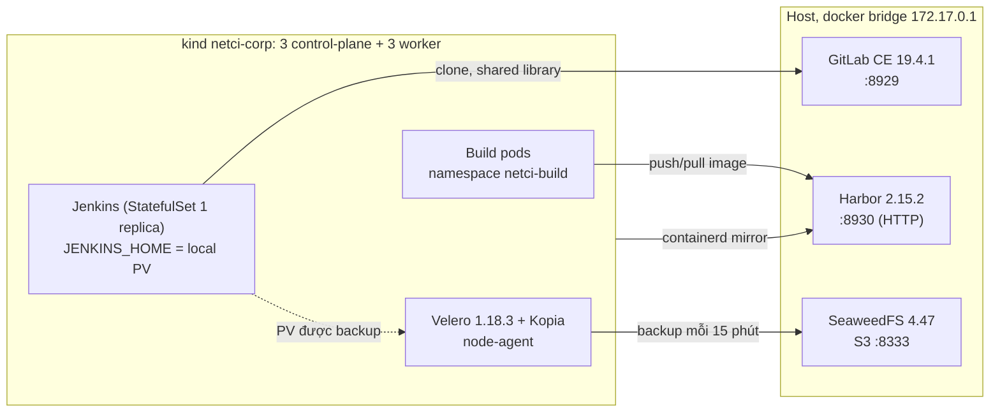

# Lab mô phỏng môi trường công ty (`netci-corp`)

Lab này chạy trên một máy, nhưng có hình dạng giống môi trường công ty: cụm Kubernetes
3 master + 3 worker, GitLab, Harbor, object storage S3, **một** Jenkins controller có
backup và failover (ADR-055), cùng toolchain do netCI quản lý tập trung (ADR-056). Lab này
đứng riêng: không dùng chung dữ liệu với stack `netci_live` hay với cụm `netci-local`.

## Thành phần



| Node | Nhãn | Vai trò |
|---|---|---|
| `netci-corp-control-plane{,2,3}` | | control plane (etcd 3 thành viên) |
| `netci-corp-worker` | `netci.io/pool=ci` | build pod |
| `netci-corp-worker2` | `pool=ci`, `jenkins-controller=eligible` | build pod, hoặc controller sau failover |
| `netci-corp-worker3` | `pool=platform`, `jenkins-controller=eligible` | controller |

Có đúng hai node mang nhãn `eligible`: khi mất một node thì controller vẫn còn chỗ để
restore sang node kia.

## Port

| Dịch vụ | Địa chỉ | Ghi chú |
|---|---|---|
| GitLab | `http://172.17.0.1:8929` | user `root`, mật khẩu ở `.netci-gate/corp/gitlab_root_password` |
| Harbor | `https://172.17.0.1:8930` | TLS bằng CA của lab; node (containerd `hosts.toml`), pod build (buildah `certs.d`, cosign/trivy qua `SSL_CERT_DIR`), netCI và máy đích đều xác thực chứng chỉ |
| S3 | `https://172.17.0.1:8333` | TLS bằng CA của lab (`.netci-gate/corp/pki/ca.crt`, `scripts/corp/lab_ca.sh`), qua gateway nginx; trả 403 cho request không ký là bình thường |
| netCI (portal + API) | `https://netci.corp.local` → VIP `172.17.255.200` (MetalLB) → 2 replica ingress-nginx trên 2 node | TLS bằng CA của lab; máy host cần `netci.corp.local` trỏ về VIP |
| Jenkins | `kubectl -n jenkins port-forward svc/jenkins 18089:8080` | không expose ra ngoài cụm |

Tất cả chỉ bind vào docker bridge, không mở trên các interface khác của máy.

## Tài nguyên (đo ngày 2026-09-26, lab đang chạy nhàn rỗi)

| Thành phần | RAM đang dùng | Giới hạn |
|---|---|---|
| GitLab | 2,9 GiB | 3 GiB (**sát giới hạn**, nếu bị OOM thì nâng `mem_limit`) |
| Harbor (9 container) | ~250 MiB | không đặt |
| SeaweedFS | ~450 MiB | 1 GiB (512 MiB từng bị OOM khi đang backup) |
| 3 control-plane | ~2,4 GiB | không đặt |
| 3 worker | ~1,6 GiB, trong đó Jenkins controller ~0,9 GiB | controller: limit 1,5 GiB |

GitLab chạy ở cấu hình nhẹ: puma worker 0, sidekiq 5, tắt monitoring/registry/pages/kas.

## Cách dùng

Runbook vận hành đầy đủ (khởi động sau reboot, backup, failover, xoay khoá, phát hành thư viện): `docs/RUNBOOK-CORP-LAB.md`.

```bash
scripts/corp/up.sh                 # dựng từ đầu hoặc bổ sung phần còn thiếu (idempotent)
scripts/corp/status.sh             # chỉ đọc: HTTP của dịch vụ, node, pod Jenkins, backup
scripts/corp/jenkins_failover.sh   # drill: đánh dấu -> backup -> hỏng node -> restore -> kiểm tra
scripts/corp/jenkins_failover.sh --planned   # chuyển có kế hoạch, backup ngay trước khi chuyển
scripts/corp/down.sh               # dừng container, giữ cluster và dữ liệu
scripts/corp/down.sh --delete      # xoá luôn cluster kind và volume của container
```

`down.sh` không bao giờ xoá `.netci-gate/corp`. GitLab, Harbor và S3 được khởi tạo bằng các
secret trong thư mục đó, và khoá repository Kopia ở đó là cách duy nhất để đọc lại backup cũ.

**Sau khi khởi động lại máy, chạy lại `scripts/corp/up.sh`.** Hai thứ không tự hồi phục: container
haproxy của cụm HA kind (không có nó thì API từ chối kết nối và worker báo NotReady), và các
container của Harbor (thoát với mã 128 vì khởi động trước `harbor-log`). `up.sh` bật lại cả hai
và bỏ qua những gì đang chạy.

Yêu cầu trên máy: `fs.inotify.max_user_instances >= 1024`
(`/etc/sysctl.d/99-netci-kind.conf`), vì mặc định 128 làm pod bị crash-loop. Harbor được cài
bằng `sudo -n`, vì installer của nó tạo thư mục dữ liệu thuộc root.

## Phiên bản đã ghim

| Thành phần | Phiên bản | Nơi ghim |
|---|---|---|
| GitLab CE | `19.4.1-ce.0` | `gitlab/docker-compose.yml` |
| Harbor | `v2.15.2` (không kèm Trivy scanner; netCI tự quét) | `harbor/install.sh` |
| SeaweedFS | `4.47` | `seaweedfs/docker-compose.yml` |
| Velero / plugin AWS | `v1.18.3` / `v1.14.3` | `velero/install.sh` |
| Jenkins chart / controller | `5.9.64` / `netci/jenkins-controller:2.541.1-netci1` | `scripts/corp/up.sh`, `jenkins/values.yaml` |
| Agent / toolbox | `inbound-agent:3386.v353e57a_1b_ea_0-1-jdk21` / `netci/ci-toolbox:0.4.0` | `jenkins/values.yaml`, `toolchain/versions.yaml` |

## Đã kiểm chứng và chưa kiểm chứng

- **Đã chạy thật:** cả sáu node Ready; GitLab có sẵn shared library (tag `netci-0.3.0`) và
  `payments-api`; Harbor có robot account; Jenkins lên bằng JCasC; drill failover PASS với
  RTO 84 s, build đánh dấu còn nguyên sau khi controller chuyển worker3 → worker2 (bằng chứng
  trong ADR-055).
- **`up.sh` chưa được chạy trọn một lượt trên máy trống.** Lab hiện tại được dựng bằng chính
  các bước này nhưng chạy tay từng bước; script gom chúng lại, mới kiểm tra cú pháp.
- **Đã đổi khoá repository Kopia** sang khoá ngẫu nhiên lưu ngoài cụm. Backup ghi vào BSL
  `jenkins-s3` (bucket `netci-jenkins-backups`); diễn tập restore từ repository mới đã PASS (RTO 63 s,
  xem ADR-055). BSL `default` và bucket `velero` cũ (khoá mặc định công khai) đang ở chế độ
  chỉ-đọc và chờ được huỷ, vì huỷ là thao tác xoá dữ liệu nên do người vận hành quyết định. Identity S3 của Velero đã bị giới hạn vào bucket mới, nên Velero không còn đọc được bucket cũ.
- **Least privilege:** netCI gọi Jenkins bằng `netci-sa` (matrix-auth, không có Administer);
  Jenkins clone bằng group token `read_repository`; designer dùng group token `api`/Developer.
- **netCI đã chạy trên `netci-corp`** (namespace `netci-system`, Pod Security `restricted`,
  database `netci_corp` với role riêng, `/readyz` 200). `scripts/corp/e2e_build.py` đã PASS
  đầu-cuối: payments-api build từ GitLab bởi Jenkins, push `apps/payments-api@sha256:a7b8…`
  lên Harbor, chữ ký cosign verify được, toolchain không drift, rồi deploy **healthy** lên
  máy đích `netci-corp-app-01` (`scripts/corp/app_host.sh`) qua SSH có pin host key.
- Designer: MR !1 đã được netCI mở thật trên GitLab; chờ người review merge rồi chạy
  `scripts/corp/e2e_designer.py verify`.
- S3, Harbor và ingress của netCI đều chạy TLS có xác thực bằng CA của lab (`scripts/corp/lab_ca.sh`). Webhook của GitLab đi `https://netci.corp.local/api/webhooks/scm/gitlab`, có xác thực SSL; GitLab chỉ được gọi nội bộ tới đúng tên đó. (webhook đi qua NodePort 30800 chỉ trong mạng kind).
